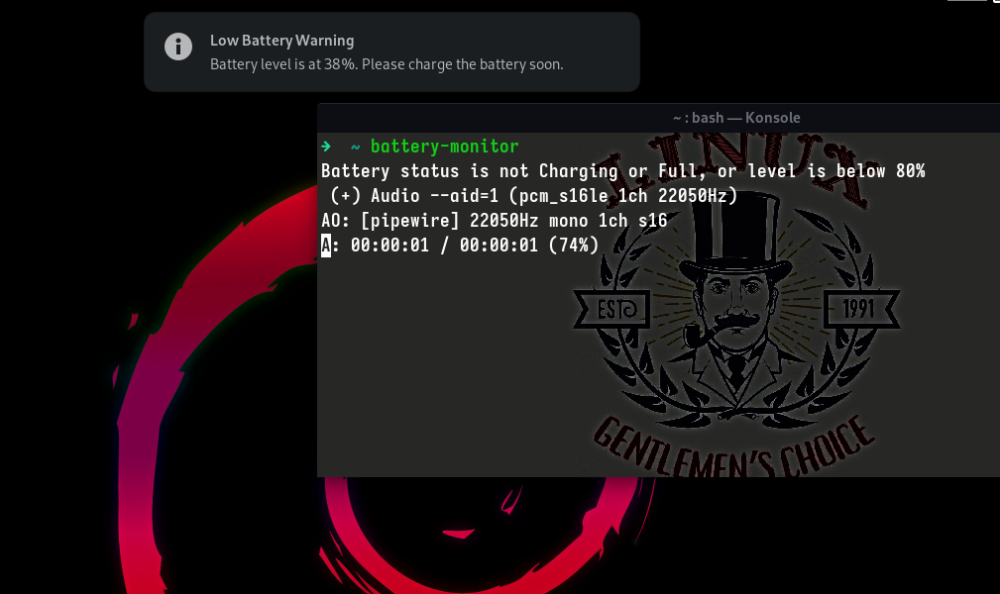

<h1 id="betik-komutları"><a class="header" href="#betik-komutları">Betik Komutları</a></h1>
<h2 id="net-tools"><a class="header" href="#net-tools">net-tools</a></h2>

    
    

<h2 id="lxc-ls-f"><a class="header" href="#lxc-ls-f">Daha iyi <code>lxc-ls -f</code> çıktısı</a></h2>

    
    

<h2 id="debian-gnome"><a class="header" href="#debian-gnome">Debian Gnome</a></h2>

    
    

<h2 id="batarya-İzleme-ve-uyarı-betiği"><a class="header" href="#batarya-İzleme-ve-uyarı-betiği">Batarya İzleme ve Uyarı Betiği</a></h2>

Bu Bash betiği, pil durumunu izler ve şarj sırasında pil seviyesi %80'in üzerine çıktığında bildirim gönderip sesli uyarı verir. Ayrıca, pil seviyesi %54'ün altına düştüğünde düşük pil uyarısı sağlar. <em>Cronjob ile otomatize edilmesi avantaj yaratır.</em>

    
    

<h2 id="zsh"><a class="header" href="#zsh">ZSH</a></h2>

Performans ve verimlilik için kullandığım kaynak.

    
    

